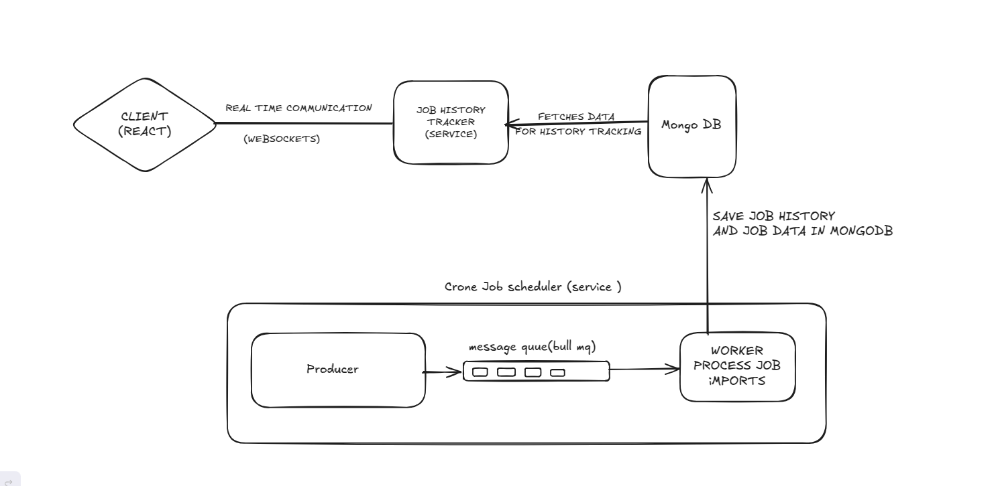
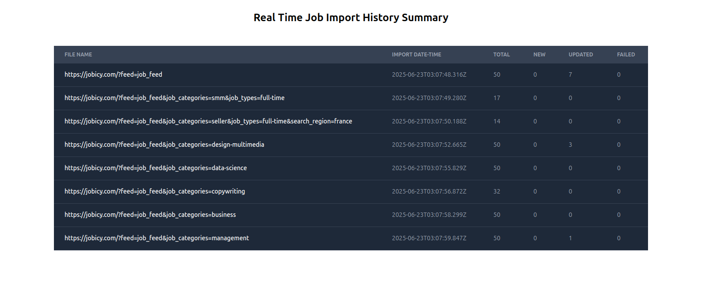

# Scalable Job Importer System with Real-time Tracking

## Overview



### Ui Screenshot



---

## 1. Running Cron Job Scheduler

Follow these steps to set up and run the cron job scheduler:

### Navigate to the Cron Job Scheduler Directory
setup your redis on  host: '127.0.0.1',port: '6379'

provide your mongoddb url in .env file  like given .env file

```bash
cd Backend/Cron-Job-Scheduler
npm instal
node producer.js
node worker.js
```

## 2. Running Job History Real-Time Service
Follow these steps to set up and run the WebSocket-based job history service:

### Navigate to the Job History Directory

provide your mongoddb url in .env file  like given .env file

```bash
cd Backend/Job-History-RealTime
npm install
node server.js
```

## 3. Running Frontend

```bash
cd Frontend/my-app
npm install
npm run dev
```