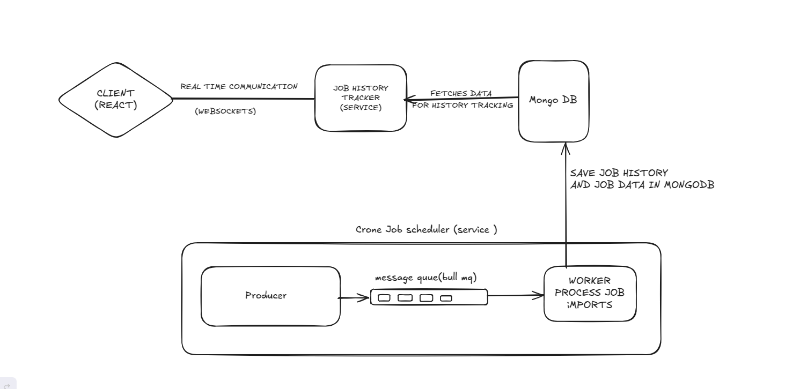
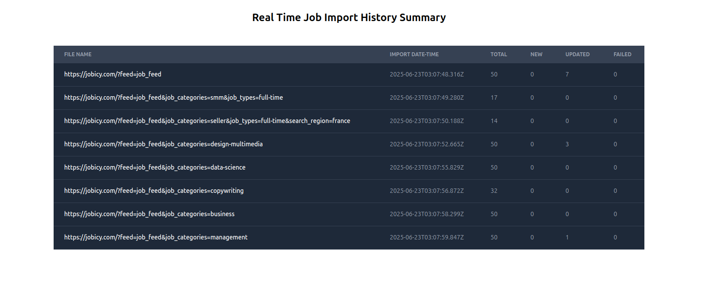

# Scalable Job Importer System with Real-time Tracking

## Overview

### Ui Screenshot

This system architecture is designed to:

- Import job data from external APIs or RSS feeds.
- Process and store the data in MongoDB.
- Provide real-time tracking and updates to clients via WebSocket.

It consists of three main services:

- **Job Producer & Worker (Cron + Queue)**
- **Job History Tracker (WebSocket)**
- **MongoDB (Database)**

---

## Architecture Components

### 1. Client (React)

- Frontend application built with React.
- Connects to the WebSocket server to receive real-time updates.
- Displays the job import history and status.

---

### 2. Job History Tracker (Service)

- A Node.js-based WebSocket server (e.g., using `socket.io`).
- Watches MongoDB (via change streams or polling) for updates to import history.
- Emits updates to connected clients through WebSocket.
- Handles initial data fetch and live updates.

**Responsibilities:**

- Maintain persistent WebSocket connections.
- Emit `initial_data` and `import_history_update` events.
- Fetch job import history from MongoDB on client connection.

---

### 3. MongoDB

- Central database for storing:
  - Raw job data (e.g., job listings)
  - Job import history (e.g., API name, import status, time, errors)

**Usage:**

- **Read**: History Tracker fetches job logs.
- **Write**: Worker saves job results and status here.

---

### 4. Cron Job Scheduler (Service Block)

#### a. Producer

- Scheduled via cron to run at fixed intervals (e.g., every minute).
- Pulls job data from external APIs or RSS feeds.
- Pushes jobs into a BullMQ queue.

#### b. BullMQ Queue

- Redis-backed queue used to buffer and manage job processing.
- Enables decoupling of job fetching from job processing.

#### c. Worker

- Listens to the BullMQ queue.
- Processes jobs (e.g., parses XML/JSON, transforms data).
- Saves job data and import history into MongoDB.

